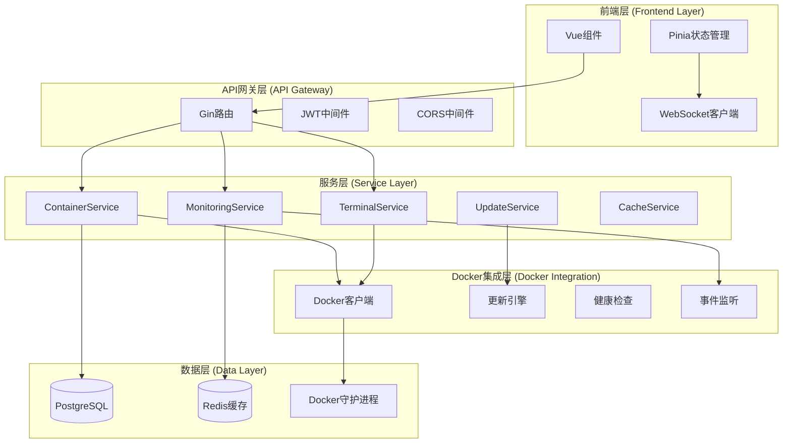

# Design Document

## Overview

Docker容器生命周期管理功能将在现有架构基础上实现真实的Docker集成，替换当前的模拟数据返回，提供完整的容器操作、监控、更新和管理能力。该设计遵循项目现有的DDD分层架构，通过增强Docker客户端包、扩展容器服务层、完善前端组件来实现全面的容器生命周期管理。

设计的核心目标是在保持现有API接口不变的前提下，实现真实的Docker引擎集成，提供高性能的容器操作、实时监控数据收集、WebSocket终端访问、智能更新策略执行等功能。

## Steering Document Alignment

### Technical Standards (tech.md)

本设计严格遵循项目技术规范：

- **Go后端架构**: 使用Go 1.23+，遵循modular monolith架构模式
- **依赖注入**: 通过结构体组合实现，便于单元测试和模块替换
- **Docker SDK集成**: 基于现有的docker.DockerClient和docker.ClientManager进行扩展
- **WebSocket实时通信**: 利用现有的WebSocket基础设施进行容器终端和监控数据传输
- **缓存层**: 集成现有的CacheService进行性能优化
- **错误处理**: 遵循Go标准错误处理模式，提供结构化错误信息
- **性能要求**: API响应时间<200ms，WebSocket延迟<50ms，内存占用<512MB

### Project Structure (structure.md)

设计遵循项目结构规范：

- **pkg/docker/**: 增强Docker客户端功能，添加监控、终端、更新引擎组件
- **internal/service/**: 扩展ContainerService，添加实时监控和自动化功能
- **internal/controller/**: 保持现有API接口，增强功能实现
- **frontend/src/components/**: 完善容器相关组件的数据集成
- **分层依赖**: Controller → Service → Repository → Model的严格分层
- **模块化设计**: 每个组件单一职责，高内聚低耦合

## Code Reuse Analysis

### Existing Components to Leverage

- **docker.DockerClient**: 现有Docker客户端基础设施，需要扩展监控和终端功能
- **docker.ClientManager**: 连接池管理，用于性能优化的多连接处理
- **docker.UpdateEngine**: 现有更新引擎框架，需要实现真实的更新逻辑
- **service.ContainerService**: 现有容器服务，需要集成真实Docker操作
- **service.CacheService**: 用于缓存容器状态和监控数据
- **WebSocket基础设施**: 现有的WebSocket连接管理，用于实时数据传输
- **认证中间件**: 现有的JWT认证和权限检查机制

### Integration Points

- **Docker Socket**: 通过unix socket或TCP连接集成Docker守护进程
- **现有数据库模型**: 使用model.Container, model.UpdateHistory等现有GORM模型
- **API路由**: 集成现有的Gin路由和中间件体系
- **前端Store**: 集成现有的Pinia状态管理和Vue组件
- **配置系统**: 使用现有的Viper配置管理体系

## Architecture

该功能采用事件驱动的微服务单体架构，在现有分层基础上增加监控层和实时通信层：



### Modular Design Principles

- **单一职责**: 容器操作、监控、终端、更新各自独立的服务模块
- **组件隔离**: Docker操作与业务逻辑分离，便于测试和扩展
- **服务层分离**: 数据访问、业务逻辑、API控制器严格分层
- **工具模块化**: 监控指标收集、事件处理、缓存管理等独立工具模块

## Components and Interfaces

### DockerRealTimeClient (扩展现有DockerClient)
- **Purpose**: 提供真实的Docker API操作，包括容器管理、监控数据收集、终端访问
- **Interfaces**:
  - `ListContainers(ctx context.Context, opts types.ContainerListOptions) ([]types.Container, error)`
  - `StartContainer(ctx context.Context, containerID string) error`
  - `StopContainer(ctx context.Context, containerID string, timeout *time.Duration) error`
  - `GetContainerStats(ctx context.Context, containerID string) (<-chan types.Stats, error)`
  - `CreateExec(ctx context.Context, containerID string, config types.ExecConfig) (types.IDResponse, error)`
  - `AttachToExec(ctx context.Context, execID string, config types.ExecStartCheck) (types.HijackedResponse, error)`
- **Dependencies**: docker.DockerClient, config.Config
- **Reuses**: 现有的docker.ConnectionPool, docker.ClientMetrics

### ContainerMonitoringService (新增)
- **Purpose**: 实时收集和处理容器监控数据，包括资源使用率、健康状态、事件日志
- **Interfaces**:
  - `StartMonitoring(ctx context.Context, containerID string) error`
  - `StopMonitoring(ctx context.Context, containerID string) error`
  - `GetRealTimeStats(containerID string) (*MonitoringData, error)`
  - `GetHistoricalStats(containerID string, timeRange TimeRange) ([]*MonitoringData, error)`
  - `SetupHealthCheck(containerID string, config HealthCheckConfig) error`
- **Dependencies**: DockerRealTimeClient, CacheService
- **Reuses**: 现有的service.CacheService, WebSocket基础设施

### WebTerminalService (新增)
- **Purpose**: 提供Web终端功能，管理Docker exec会话和WebSocket连接
- **Interfaces**:
  - `CreateTerminalSession(ctx context.Context, containerID string, userID int64) (*TerminalSession, error)`
  - `AttachWebSocket(sessionID string, ws *websocket.Conn) error`
  - `ExecuteCommand(sessionID string, command string) error`
  - `CloseSession(sessionID string) error`
- **Dependencies**: DockerRealTimeClient, 认证服务
- **Reuses**: 现有的WebSocket管理器，JWT认证

### ContainerUpdateEngine (扩展现有UpdateEngine)
- **Purpose**: 执行智能容器更新策略，包括滚动更新、健康检查、自动回滚
- **Interfaces**:
  - `CheckForUpdates(ctx context.Context, containerID string) (*UpdateInfo, error)`
  - `ExecuteUpdate(ctx context.Context, containerID string, strategy UpdateStrategy) error`
  - `ExecuteRollback(ctx context.Context, containerID string) error`
  - `ScheduleUpdate(containerID string, schedule string, strategy UpdateStrategy) error`
- **Dependencies**: DockerRealTimeClient, ContainerMonitoringService
- **Reuses**: 现有的docker.UpdateEngine, scheduler.CronService

### Frontend ContainerMonitor组件 (扩展现有组件)
- **Purpose**: 实时显示容器状态、性能图表、操作控制
- **Interfaces**: Vue组合式API
- **Dependencies**: axios HTTP客户端, ECharts可视化库, WebSocket连接
- **Reuses**: 现有的Vue组件架构, Element Plus UI库, Pinia状态管理

## Data Models

### ContainerRuntimeInfo (扩展现有Container模型)
```go
type ContainerRuntimeInfo struct {
    // 基础信息 (复用现有字段)
    ID          string                 `json:"id" gorm:"primaryKey"`
    Name        string                 `json:"name" gorm:"index"`
    Image       string                 `json:"image"`
    Status      ContainerStatus        `json:"status"`

    // 运行时信息 (新增)
    DockerID    string                 `json:"docker_id" gorm:"index"`
    State       types.ContainerState   `json:"state"`
    Config      types.ContainerJSON    `json:"config" gorm:"type:jsonb"`

    // 监控相关 (新增)
    CPUPercent  float64               `json:"cpu_percent"`
    MemoryUsage int64                 `json:"memory_usage"`
    MemoryLimit int64                 `json:"memory_limit"`
    NetworkIO   NetworkIOStats        `json:"network_io"`
    DiskIO      DiskIOStats           `json:"disk_io"`

    // 时间戳
    LastUpdated time.Time             `json:"last_updated"`
    CreatedAt   time.Time             `json:"created_at"`
}
```

### TerminalSession (新增)
```go
type TerminalSession struct {
    ID          string    `json:"id" gorm:"primaryKey"`
    ContainerID string    `json:"container_id" gorm:"index"`
    UserID      int64     `json:"user_id" gorm:"index"`
    DockerExecID string   `json:"docker_exec_id"`
    Status      SessionStatus `json:"status"`
    CreatedAt   time.Time `json:"created_at"`
    ExpiresAt   time.Time `json:"expires_at"`
    LastActivity time.Time `json:"last_activity"`
}
```

### MonitoringMetrics (新增)
```go
type MonitoringMetrics struct {
    ContainerID   string            `json:"container_id" gorm:"index"`
    Timestamp     time.Time         `json:"timestamp" gorm:"index"`
    CPUStats      CPUMetrics        `json:"cpu_stats" gorm:"type:jsonb"`
    MemoryStats   MemoryMetrics     `json:"memory_stats" gorm:"type:jsonb"`
    NetworkStats  []NetworkMetrics  `json:"network_stats" gorm:"type:jsonb"`
    DiskStats     DiskMetrics       `json:"disk_stats" gorm:"type:jsonb"`
    HealthStatus  HealthStatus      `json:"health_status"`
}
```

### UpdateSchedule (扩展现有)
```go
type UpdateSchedule struct {
    ID              int64           `json:"id" gorm:"primaryKey"`
    ContainerID     string          `json:"container_id" gorm:"index"`
    CronExpression  string          `json:"cron_expression"`
    UpdateStrategy  UpdateStrategy  `json:"update_strategy"`
    AutoRollback    bool            `json:"auto_rollback"`
    HealthCheckConfig HealthCheckConfig `json:"health_check_config" gorm:"type:jsonb"`
    Enabled         bool            `json:"enabled"`
    CreatedAt       time.Time       `json:"created_at"`
    UpdatedAt       time.Time       `json:"updated_at"`
}
```

## Error Handling

### Error Scenarios

1. **Docker守护进程不可用**
   - **Handling**: 实施重试机制，记录错误日志，切换到只读模式
   - **User Impact**: 显示连接状态警告，禁用操作按钮，提供重连选项

2. **容器操作失败**
   - **Handling**: 记录详细错误信息，回滚状态变更，发送通知
   - **User Impact**: 显示具体错误消息，提供解决建议，支持重试操作

3. **监控数据收集失败**
   - **Handling**: 使用缓存数据，降级显示历史信息，记录错误
   - **User Impact**: 显示数据延迟警告，提供手动刷新选项

4. **WebSocket终端连接断开**
   - **Handling**: 自动重连机制，保存会话状态，清理资源
   - **User Impact**: 显示连接状态，提供重连按钮，保留输入历史

5. **更新过程失败**
   - **Handling**: 执行自动回滚，记录失败原因，发送告警通知
   - **User Impact**: 显示回滚状态，提供详细日志，支持手动重试

6. **权限不足**
   - **Handling**: 验证用户权限，记录访问尝试，返回友好错误
   - **User Impact**: 显示权限错误提示，隐藏无权限操作，提供申请链接

## Testing Strategy

### Unit Testing

- **Docker客户端模块**: 模拟Docker API响应，测试连接管理和操作执行
- **监控服务**: 测试指标收集、数据处理、缓存逻辑
- **更新引擎**: 测试更新策略执行、回滚机制、调度功能
- **终端服务**: 测试会话管理、命令执行、WebSocket处理
- **测试覆盖率目标**: >85%

### Integration Testing

- **Docker集成测试**: 使用测试容器验证真实Docker操作
- **数据库集成**: 测试容器状态持久化和查询功能
- **WebSocket通信**: 测试实时数据传输和终端交互
- **缓存集成**: 测试Redis缓存的数据一致性
- **认证集成**: 测试权限控制和会话管理

### End-to-End Testing

- **容器生命周期**: 创建 → 启动 → 监控 → 更新 → 停止 → 删除完整流程
- **监控仪表板**: 实时数据显示、图表更新、告警触发
- **Web终端**: 终端访问、命令执行、会话管理
- **自动更新**: 更新检测 → 策略执行 → 健康检查 → 回滚测试
- **用户权限**: 不同角色用户的功能访问权限验证
- **性能测试**: 并发容器操作、大量监控数据处理

### 测试环境配置

- **Docker测试环境**: 使用Docker-in-Docker或测试专用Docker守护进程
- **数据库**: 使用SQLite内存数据库进行快速测试
- **Mock服务**: 模拟外部依赖（注册中心、通知服务等）
- **自动化测试**: 集成GitHub Actions进行CI/CD测试