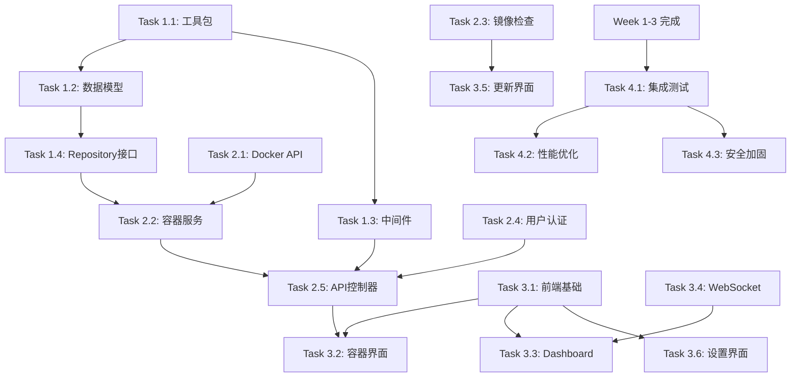

# Docker Auto Update System - 开发计划

## 📋 项目概览

**项目名称**: Docker Auto Update System
**架构**: Go后端 + Vue3前端 + PostgreSQL数据库 (无Redis)
**开发周期**: 4-5周
**开发方式**: 多Agent并行开发

## 🎯 开发阶段规划

### Phase 1: 基础设施 (Week 1)
**目标**: 搭建核心基础设施，为后续开发提供基础

### Phase 2: 核心服务 (Week 2-3)
**目标**: 实现核心业务逻辑和API接口

### Phase 3: 前端开发 (Week 3-4)
**目标**: 实现完整的Web管理界面

### Phase 4: 集成测试 (Week 4-5)
**目标**: 系统集成、测试和优化

---

## 🚀 Week 1: 基础设施开发

### 🎯 本周目标
- ✅ 完成所有基础工具包
- ✅ 定义所有数据模型
- ✅ 实现基础中间件
- ✅ 建立开发和测试环境

### 📋 详细任务列表

#### Task 1.1: 工具包开发 🛠️
**负责Agent**: `go-expert`
**状态**: ⏳ 待开始
**估时**: 1.5天
**优先级**: 🔥 最高

**子任务**:
- [ ] `pkg/utils/database.go` - 数据库连接和迁移工具
- [ ] `pkg/utils/cache.go` - 内存缓存实现 (sync.Map + TTL)
- [ ] `pkg/utils/jwt.go` - JWT认证工具函数
- [ ] `pkg/utils/crypto.go` - 加密解密工具
- [ ] `pkg/utils/response.go` - 统一API响应格式
- [ ] `pkg/utils/validator.go` - 数据验证工具
- [ ] `pkg/utils/logger.go` - 日志工具封装

**验收标准**:
- 所有工具函数通过单元测试
- 数据库连接和迁移功能正常
- 内存缓存支持TTL和自动清理
- JWT生成和验证功能完整

---

#### Task 1.2: 数据模型定义 📊
**负责Agent**: `sql-pro`
**状态**: ⏳ 待开始
**估时**: 1天
**优先级**: 🔥 最高

**子任务**:
- [ ] `internal/model/user.go` - 用户模型和验证
- [ ] `internal/model/container.go` - 容器模型和关联
- [ ] `internal/model/update_history.go` - 更新历史模型
- [ ] `internal/model/image_version.go` - 镜像版本缓存模型
- [ ] `internal/model/system_config.go` - 系统配置模型
- [ ] `internal/model/notification.go` - 通知相关模型
- [ ] `internal/model/scheduled_task.go` - 定时任务模型

**验收标准**:
- 所有模型包含完整的GORM标签
- 模型关联关系正确定义
- 数据验证规则完整
- 支持JSON序列化和反序列化

---

#### Task 1.3: 基础中间件 🛡️
**负责Agent**: `go-expert`
**状态**: ⏳ 待开始
**估时**: 1天
**优先级**: 🔥 高

**子任务**:
- [ ] `internal/middleware/jwt.go` - JWT认证中间件
- [ ] `internal/middleware/cors.go` - CORS跨域中间件
- [ ] `internal/middleware/logger.go` - 请求日志中间件
- [ ] `internal/middleware/error.go` - 错误处理中间件
- [ ] `internal/middleware/rate_limit.go` - 限流中间件
- [ ] `internal/middleware/permission.go` - 权限验证中间件

**验收标准**:
- JWT中间件支持Token验证和用户信息提取
- CORS中间件配置灵活
- 日志中间件记录详细请求信息
- 错误中间件统一错误响应格式

---

#### Task 1.4: Repository接口定义 📚
**负责Agent**: `backend-architect`
**状态**: ⏳ 待开始
**估时**: 0.5天
**优先级**: 🔥 高

**子任务**:
- [ ] `internal/repository/interfaces.go` - 所有Repository接口定义
- [ ] `internal/repository/container.go` - 容器Repository实现
- [ ] `internal/repository/user.go` - 用户Repository实现
- [ ] `internal/repository/image_version.go` - 镜像版本Repository实现
- [ ] `internal/repository/system_config.go` - 配置Repository实现

**验收标准**:
- Repository接口设计清晰，支持所有CRUD操作
- 支持复杂查询和分页
- 包含事务处理支持
- 接口注释完整

---

#### Task 1.5: 缓存服务实现 🧠
**负责Agent**: `go-expert`
**状态**: ⏳ 待开始
**估时**: 1天
**优先级**: 🔥 中

**子任务**:
- [ ] `internal/service/cache.go` - 内存缓存服务实现
- [ ] 缓存TTL管理和自动清理机制
- [ ] 镜像信息专用缓存方法
- [ ] 系统配置缓存方法
- [ ] 缓存统计和监控

**验收标准**:
- 支持不同TTL的缓存策略
- 自动清理过期缓存
- 线程安全的并发访问
- 缓存命中率统计

---

### 🔄 Week 1 并行执行计划

**Day 1-2**:
- Task 1.1 (工具包) + Task 1.2 (数据模型) 并行执行
- Task 1.4 (Repository接口) 并行开始

**Day 3-4**:
- Task 1.3 (中间件) + Task 1.5 (缓存服务) 并行执行
- Week 1集成测试

**Day 5**:
- Week 1完整性验证和文档更新
- 准备Week 2的工作

---

## 🚀 Week 2: 核心服务开发

### 🎯 本周目标
- ✅ 完成Docker API集成
- ✅ 实现所有Service层
- ✅ 完成基础API控制器
- ✅ 实现认证系统

### 📋 详细任务列表

#### Task 2.1: Docker API集成 🐳
**负责Agent**: `docker-expert`
**状态**: ⏳ 待开始
**估时**: 2天
**优先级**: 🔥 最高

**子任务**:
- [ ] `pkg/docker/client.go` - Docker客户端连接和配置
- [ ] `pkg/docker/container.go` - 容器生命周期操作
- [ ] `pkg/docker/image.go` - 镜像操作和信息获取
- [ ] `pkg/docker/logs.go` - 容器日志流处理
- [ ] `pkg/docker/stats.go` - 容器状态和资源监控
- [ ] `pkg/docker/types.go` - Docker相关数据类型定义

**验收标准**:
- 支持所有容器生命周期操作 (创建、启动、停止、删除)
- 镜像拉取和信息查询功能完整
- 实时日志流和状态监控
- 完善的错误处理和重试机制

---

#### Task 2.2: 容器管理服务 📦
**负责Agent**: `go-expert`
**状态**: ⏳ 待开始
**估时**: 2天
**优先级**: 🔥 最高

**子任务**:
- [ ] `internal/service/container.go` - 容器管理业务逻辑
- [ ] 容器CRUD操作和配置管理
- [ ] 容器状态同步和监控
- [ ] 容器操作日志记录
- [ ] 批量操作支持

**验收标准**:
- 完整的容器CRUD功能
- 容器配置验证和安全检查
- 支持批量操作
- 详细的操作日志

---

#### Task 2.3: 镜像检查服务 🔍
**负责Agent**: `go-expert`
**状态**: ⏳ 待开始
**估时**: 2天
**优先级**: 🔥 高

**子任务**:
- [ ] `internal/service/image.go` - 镜像检查和版本管理
- [ ] `pkg/registry/dockerhub.go` - Docker Hub API集成
- [ ] `pkg/registry/harbor.go` - Harbor私有仓库支持
- [ ] `pkg/registry/checker.go` - 通用镜像检查器
- [ ] 版本比较和更新策略

**验收标准**:
- 支持多种镜像仓库
- 智能版本比较算法
- 缓存机制优化性能
- 支持私有仓库认证

---

#### Task 2.4: 用户认证服务 👤
**负责Agent**: `go-expert`
**状态**: ⏳ 待开始
**估时**: 1.5天
**优先级**: 🔥 高

**子任务**:
- [ ] `internal/service/user.go` - 用户管理和认证服务
- [ ] 用户注册和登录逻辑
- [ ] 密码加密和验证
- [ ] 用户权限管理
- [ ] 用户配置管理

**验收标准**:
- 安全的密码存储和验证
- 完整的用户权限控制
- 支持用户配置更新
- JWT Token生成和验证

---

#### Task 2.5: API控制器开发 🌐
**负责Agent**: `go-expert`
**状态**: ⏳ 待开始
**估时**: 2天
**优先级**: 🔥 高

**子任务**:
- [ ] `internal/api/auth.go` - 认证相关API
- [ ] `internal/api/container.go` - 容器管理API
- [ ] `internal/api/image.go` - 镜像相关API
- [ ] `internal/api/system.go` - 系统状态API
- [ ] `internal/api/routes.go` - 路由配置和文档

**验收标准**:
- 完整的RESTful API设计
- 请求参数验证和响应格式统一
- API文档自动生成 (Swagger)
- 完善的错误处理

---

#### Task 2.6: 任务调度系统 ⏰
**负责Agent**: `go-expert`
**状态**: ⏳ 待开始
**估时**: 1.5天
**优先级**: 🔥 中

**子任务**:
- [ ] `internal/service/scheduler.go` - 任务调度服务
- [ ] `internal/scheduler/cron.go` - Cron任务管理
- [ ] `internal/scheduler/task.go` - 任务执行器
- [ ] `internal/scheduler/queue.go` - 内存任务队列

**验收标准**:
- 支持灵活的Cron表达式
- 任务执行状态跟踪
- 支持任务优先级和重试
- 任务执行历史记录

---

### 🔄 Week 2 并行执行计划

**Day 1-2**:
- Task 2.1 (Docker API) + Task 2.4 (用户认证) 并行执行

**Day 3-4**:
- Task 2.2 (容器服务) + Task 2.3 (镜像检查) 并行执行

**Day 5**:
- Task 2.5 (API控制器) + Task 2.6 (任务调度) 并行执行

---

## 🚀 Week 3: 前端开发 + API完善

### 🎯 本周目标
- ✅ 完成前端基础框架
- ✅ 实现主要管理界面
- ✅ 完善后端API功能
- ✅ 实现WebSocket实时通信

### 📋 详细任务列表

#### Task 3.1: 前端基础组件 🎨
**负责Agent**: `frontend-developer`
**状态**: ⏳ 待开始
**估时**: 2天
**优先级**: 🔥 最高

**子任务**:
- [ ] `src/views/Layout.vue` - 主布局组件
- [ ] `src/views/Login.vue` - 登录页面
- [ ] `src/components/Header.vue` - 页面头部
- [ ] `src/components/Sidebar.vue` - 侧边导航
- [ ] `src/components/Loading.vue` - 加载组件
- [ ] `src/utils/auth.js` - 认证工具函数
- [ ] `src/api/request.js` - HTTP请求封装

**验收标准**:
- 响应式布局设计
- 统一的UI风格和交互
- 完整的路由守卫
- 错误处理和加载状态

---

#### Task 3.2: 容器管理界面 📦
**负责Agent**: `frontend-developer`
**状态**: ⏳ 待开始
**估时**: 2天
**优先级**: 🔥 最高

**子任务**:
- [ ] `src/views/Containers.vue` - 容器列表页面
- [ ] `src/views/ContainerDetail.vue` - 容器详情页面
- [ ] `src/components/ContainerCard.vue` - 容器卡片组件
- [ ] `src/components/ContainerForm.vue` - 容器配置表单
- [ ] `src/components/LogViewer.vue` - 日志查看器
- [ ] `src/api/container.js` - 容器API调用

**验收标准**:
- 完整的容器CRUD操作界面
- 实时容器状态显示
- 容器日志实时查看
- 批量操作支持

---

#### Task 3.3: Dashboard仪表盘 📊
**负责Agent**: `frontend-developer`
**状态**: ⏳ 待开始
**估时**: 1.5天
**优先级**: 🔥 高

**子任务**:
- [ ] `src/views/Dashboard.vue` - 仪表盘主页
- [ ] `src/components/StatCard.vue` - 统计卡片组件
- [ ] `src/components/StatusChart.vue` - 状态图表组件
- [ ] `src/components/RecentUpdates.vue` - 最近更新组件
- [ ] 系统状态监控和图表

**验收标准**:
- 实时系统状态展示
- 容器状态分布图表
- 更新历史时间线
- 性能指标展示

---

#### Task 3.4: WebSocket实时通信 🔄
**负责Agent**: `go-expert`
**状态**: ⏳ 待开始
**估时**: 1.5天
**优先级**: 🔥 中

**子任务**:
- [ ] `internal/api/websocket.go` - WebSocket服务端处理
- [ ] `internal/service/notification.go` - 通知服务
- [ ] `src/utils/websocket.js` - 前端WebSocket客户端
- [ ] 实时状态推送和事件通知

**验收标准**:
- 稳定的WebSocket连接
- 实时容器状态更新
- 更新进度推送
- 连接断开重连机制

---

#### Task 3.5: 更新管理界面 🔄
**负责Agent**: `frontend-developer`
**状态**: ⏳ 待开始
**估时**: 1.5天
**优先级**: 🔥 中

**子任务**:
- [ ] `src/views/Updates.vue` - 更新中心页面
- [ ] `src/components/UpdateHistory.vue` - 更新历史组件
- [ ] `src/components/UpdateProgress.vue` - 更新进度组件
- [ ] `src/api/update.js` - 更新相关API

**验收标准**:
- 更新历史查看和过滤
- 手动触发更新功能
- 更新进度实时显示
- 回滚功能界面

---

#### Task 3.6: 系统设置界面 ⚙️
**负责Agent**: `frontend-developer`
**状态**: ⏳ 待开始
**估时**: 1天
**优先级**: 🔥 中

**子任务**:
- [ ] `src/views/Settings.vue` - 系统设置页面
- [ ] `src/components/ConfigForm.vue` - 配置表单组件
- [ ] `src/components/UserProfile.vue` - 用户配置组件
- [ ] 系统配置和用户管理界面

**验收标准**:
- 系统配置修改界面
- 用户信息管理
- 通知设置配置
- 镜像仓库配置

---

### 🔄 Week 3 并行执行计划

**Day 1-2**:
- Task 3.1 (前端基础) + Task 3.4 (WebSocket) 并行执行

**Day 3-4**:
- Task 3.2 (容器界面) + Task 3.3 (Dashboard) 并行执行

**Day 5**:
- Task 3.5 (更新界面) + Task 3.6 (设置界面) 并行执行

---

## 🚀 Week 4: 系统集成和优化

### 🎯 本周目标
- ✅ 完成前后端集成
- ✅ 系统功能测试
- ✅ 性能优化
- ✅ 文档完善

### 📋 详细任务列表

#### Task 4.1: 系统集成测试 🔧
**负责Agent**: `general-purpose`
**状态**: ⏳ 待开始
**估时**: 2天
**优先级**: 🔥 最高

**子任务**:
- [ ] 前后端接口联调
- [ ] 容器操作功能测试
- [ ] 镜像检查功能测试
- [ ] 用户认证流程测试
- [ ] WebSocket实时通信测试

**验收标准**:
- 所有API接口正常工作
- 前端界面功能完整
- 实时通信稳定
- 错误处理完善

---

#### Task 4.2: 性能优化 ⚡
**负责Agent**: `go-expert`
**状态**: ⏳ 待开始
**估时**: 1.5天
**优先级**: 🔥 高

**子任务**:
- [ ] 数据库查询优化
- [ ] 缓存策略优化
- [ ] 并发处理优化
- [ ] 前端性能优化

**验收标准**:
- API响应时间 < 500ms
- 缓存命中率 > 80%
- 支持100+并发请求
- 前端加载时间 < 3s

---

#### Task 4.3: 安全加固 🛡️
**负责Agent**: `go-expert`
**状态**: ⏳ 待开始
**估时**: 1天
**优先级**: 🔥 高

**子任务**:
- [ ] 输入验证加强
- [ ] SQL注入防护
- [ ] XSS防护
- [ ] Docker Socket安全

**验收标准**:
- 通过基础安全扫描
- 敏感数据加密存储
- 权限控制完善
- Docker操作安全

---

#### Task 4.4: 监控和日志 📊
**负责Agent**: `go-expert`
**状态**: ⏳ 待开始
**估时**: 1天
**优先级**: 🔥 中

**子任务**:
- [ ] 系统监控指标
- [ ] 结构化日志输出
- [ ] 健康检查端点
- [ ] 错误告警机制

**验收标准**:
- 完整的系统监控
- 详细的操作日志
- 健康状态检查
- 异常自动告警

---

#### Task 4.5: 文档完善 📚
**负责Agent**: `general-purpose`
**状态**: ⏳ 待开始
**估时**: 1天
**优先级**: 🔥 中

**子任务**:
- [ ] API接口文档
- [ ] 部署文档
- [ ] 用户手册
- [ ] 开发文档

**验收标准**:
- 完整的API文档
- 详细的部署指南
- 用户操作手册
- 代码文档注释

---

### 🔄 Week 4 并行执行计划

**Day 1-2**:
- Task 4.1 (集成测试) 为主，其他任务配合

**Day 3-4**:
- Task 4.2 (性能优化) + Task 4.3 (安全加固) 并行执行

**Day 5**:
- Task 4.4 (监控日志) + Task 4.5 (文档完善) 并行执行

---

## 🎯 Agent分工策略

### 🤖 专门Agent职责

#### `go-expert` - Go开发专家
**负责任务**:
- 所有Go后端代码开发
- 性能优化和安全加固
- 缓存和并发处理
- API接口实现

#### `frontend-developer` - 前端开发专家
**负责任务**:
- Vue 3前端应用开发
- 用户界面设计和实现
- 前端性能优化
- 用户体验优化

#### `docker-expert` - Docker专家
**负责任务**:
- Docker API集成
- 容器操作安全
- Docker配置优化
- 容器化部署

#### `sql-pro` - 数据库专家
**负责任务**:
- 数据模型设计
- 数据库优化
- 复杂查询实现
- 数据库安全

#### `backend-architect` - 后端架构师
**负责任务**:
- 系统架构设计
- 接口定义和规范
- 代码审查
- 架构优化建议

#### `general-purpose` - 通用Agent
**负责任务**:
- 系统集成测试
- 文档编写
- 项目协调
- 综合性任务

---

## 📊 任务跟踪系统

### 🎯 状态标记说明

- ⏳ **待开始** - 任务尚未开始
- 🔄 **进行中** - 任务正在执行
- ✅ **已完成** - 任务已完成
- ⚠️ **有问题** - 任务遇到阻塞
- 🔒 **等待依赖** - 等待其他任务完成

### 📈 进度跟踪

#### Week 1 进度 (0/5 完成)
- [ ] Task 1.1: 工具包开发 (⏳ 待开始)
- [ ] Task 1.2: 数据模型定义 (⏳ 待开始)
- [ ] Task 1.3: 基础中间件 (⏳ 待开始)
- [ ] Task 1.4: Repository接口定义 (⏳ 待开始)
- [ ] Task 1.5: 缓存服务实现 (⏳ 待开始)

#### Week 2 进度 (0/6 完成)
- [ ] Task 2.1: Docker API集成 (⏳ 待开始)
- [ ] Task 2.2: 容器管理服务 (⏳ 待开始)
- [ ] Task 2.3: 镜像检查服务 (⏳ 待开始)
- [ ] Task 2.4: 用户认证服务 (⏳ 待开始)
- [ ] Task 2.5: API控制器开发 (⏳ 待开始)
- [ ] Task 2.6: 任务调度系统 (⏳ 待开始)

#### Week 3 进度 (0/6 完成)
- [ ] Task 3.1: 前端基础组件 (⏳ 待开始)
- [ ] Task 3.2: 容器管理界面 (⏳ 待开始)
- [ ] Task 3.3: Dashboard仪表盘 (⏳ 待开始)
- [ ] Task 3.4: WebSocket实时通信 (⏳ 待开始)
- [ ] Task 3.5: 更新管理界面 (⏳ 待开始)
- [ ] Task 3.6: 系统设置界面 (⏳ 待开始)

#### Week 4 进度 (0/5 完成)
- [ ] Task 4.1: 系统集成测试 (⏳ 待开始)
- [ ] Task 4.2: 性能优化 (⏳ 待开始)
- [ ] Task 4.3: 安全加固 (⏳ 待开始)
- [ ] Task 4.4: 监控和日志 (⏳ 待开始)
- [ ] Task 4.5: 文档完善 (⏳ 待开始)

---

## 🔗 任务依赖关系

---

## 🚀 并行执行优化策略

### 📅 Day-by-Day 执行计划

#### Week 1
**Day 1**: 启动 Task 1.1 + Task 1.2
**Day 2**: 继续 Task 1.1 + Task 1.2，启动 Task 1.4
**Day 3**: 启动 Task 1.3 + Task 1.5
**Day 4**: 完成所有 Week 1 任务
**Day 5**: Week 1 集成测试和验收

#### Week 2
**Day 1**: 启动 Task 2.1 + Task 2.4
**Day 2**: 继续 Task 2.1 + Task 2.4
**Day 3**: 启动 Task 2.2 + Task 2.3
**Day 4**: 继续 Task 2.2 + Task 2.3
**Day 5**: 完成 Task 2.5 + Task 2.6

#### Week 3
**Day 1**: 启动 Task 3.1 + Task 3.4
**Day 2**: 继续 Task 3.1，完成 Task 3.4
**Day 3**: 启动 Task 3.2 + Task 3.3
**Day 4**: 继续 Task 3.2 + Task 3.3
**Day 5**: 完成 Task 3.5 + Task 3.6

#### Week 4
**Day 1-2**: Task 4.1 (集成测试)
**Day 3**: Task 4.2 + Task 4.3
**Day 4**: 继续 Task 4.2 + Task 4.3
**Day 5**: Task 4.4 + Task 4.5

---

## 📋 验收和交付标准

### 🎯 Week 1 交付物
- ✅ 完整的工具包库
- ✅ 所有数据模型定义
- ✅ 基础中间件系统
- ✅ Repository接口和实现
- ✅ 内存缓存服务

### 🎯 Week 2 交付物
- ✅ Docker API集成
- ✅ 容器管理服务
- ✅ 镜像检查服务
- ✅ 用户认证系统
- ✅ 完整的REST API
- ✅ 任务调度系统

### 🎯 Week 3 交付物
- ✅ 完整的前端应用
- ✅ 容器管理界面
- ✅ 系统仪表盘
- ✅ 实时通信功能
- ✅ 更新管理界面
- ✅ 系统设置界面

### 🎯 Week 4 交付物
- ✅ 完整的系统集成
- ✅ 性能和安全优化
- ✅ 监控和日志系统
- ✅ 完整的项目文档
- ✅ 部署就绪的系统

---

## 🔧 开发环境和工具

### 🛠️ 必需工具
- Go 1.21+
- Node.js 18+
- Docker & Docker Compose
- PostgreSQL 15+
- Git
- VS Code / GoLand

### 📊 质量保证
- 单元测试覆盖率 > 80%
- 集成测试完整
- 代码审查机制
- 自动化CI/CD

### 📈 性能指标
- API响应时间 < 500ms
- 前端首次加载 < 3s
- 支持100+并发用户
- 内存使用 < 512MB

---

## 📞 协调和沟通

### 🎯 每日站会
- 每日同步各Agent进度
- 识别阻塞和依赖问题
- 调整任务优先级
- 分享技术方案

### 📋 周总结
- 每周五总结完成情况
- 更新任务状态
- 计划下周工作
- 技术债务评估

### 🚨 问题升级
- 任务阻塞超过4小时升级
- 技术难题及时讨论
- 架构调整需要评审
- 性能问题优先处理

---

**最后更新**: 2024-01-01
**文档版本**: 1.0
**维护者**: 开发团队

---

> 💡 **提示**: 这个开发计划支持多Agent并行开发，每个Agent专注于自己的领域，通过合理的任务分解和依赖管理，可以显著提高开发效率。记住及时更新任务状态，保持团队同步！