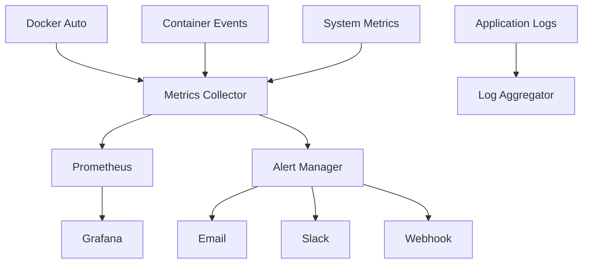

# 监控与告警配置

## 概述

Docker Auto 提供全方位的监控与告警功能，包括系统指标监控、容器状态监控、业务指标追踪和多渠道告警通知。

## 监控架构

### 监控组件


## 指标监控

### 系统指标

#### CPU 和内存监控
```yaml
system_metrics:
  cpu:
    usage_percent: true          # CPU 使用百分比
    load_average: true           # 系统负载
    per_core_usage: true         # 每核心使用率

  memory:
    usage_bytes: true            # 内存使用量
    usage_percent: true          # 内存使用百分比
    swap_usage: true             # Swap 使用情况
    cache_buffers: true          # 缓存和缓冲区
```

#### 磁盘和网络监控
```yaml
system_metrics:
  disk:
    usage_bytes: true            # 磁盘使用量
    usage_percent: true          # 磁盘使用百分比
    io_operations: true          # 磁盘 I/O 操作数
    io_time: true                # 磁盘 I/O 时间

  network:
    bytes_sent: true             # 发送字节数
    bytes_received: true         # 接收字节数
    packets_sent: true           # 发送包数
    packets_received: true       # 接收包数
    errors: true                 # 网络错误数
```

### 应用指标

#### Docker Auto 应用指标
```yaml
application_metrics:
  http:
    request_duration: true       # HTTP 请求响应时间
    request_count: true          # HTTP 请求总数
    request_errors: true         # HTTP 错误请求数
    concurrent_connections: true  # 并发连接数

  database:
    connection_pool_size: true   # 数据库连接池大小
    active_connections: true     # 活跃数据库连接数
    query_duration: true         # 数据库查询时间
    slow_queries: true           # 慢查询数量

  containers:
    total_count: true            # 容器总数
    running_count: true          # 运行中容器数
    failed_count: true           # 失败容器数
    update_success_rate: true    # 更新成功率
```

### 容器指标

#### 容器资源监控
```yaml
container_metrics:
  resource:
    cpu_usage: true              # 容器 CPU 使用率
    memory_usage: true           # 容器内存使用量
    memory_limit: true           # 容器内存限制
    network_io: true             # 容器网络 I/O
    block_io: true               # 容器块设备 I/O

  status:
    health_check: true           # 健康检查状态
    restart_count: true          # 重启次数
    uptime: true                 # 运行时间
    exit_code: true              # 退出代码
```

## Prometheus 配置

### Prometheus 服务器配置
```yaml
# prometheus.yml
global:
  scrape_interval: 15s
  evaluation_interval: 15s

rule_files:
  - "alert_rules.yml"

scrape_configs:
  - job_name: 'docker-auto'
    static_configs:
      - targets: ['docker-auto:8080']
    metrics_path: '/metrics'
    scrape_interval: 30s

  - job_name: 'node-exporter'
    static_configs:
      - targets: ['node-exporter:9100']

  - job_name: 'cadvisor'
    static_configs:
      - targets: ['cadvisor:8080']

alerting:
  alertmanagers:
    - static_configs:
        - targets: ['alertmanager:9093']
```

### Docker Compose 部署
```yaml
version: '3.8'
services:
  prometheus:
    image: prom/prometheus:latest
    ports:
      - "9090:9090"
    volumes:
      - ./prometheus.yml:/etc/prometheus/prometheus.yml
      - ./alert_rules.yml:/etc/prometheus/alert_rules.yml
      - prometheus-data:/prometheus
    command:
      - '--config.file=/etc/prometheus/prometheus.yml'
      - '--storage.tsdb.path=/prometheus'
      - '--web.console.libraries=/etc/prometheus/console_libraries'
      - '--web.console.templates=/etc/prometheus/consoles'
      - '--web.enable-lifecycle'

  node-exporter:
    image: prom/node-exporter:latest
    ports:
      - "9100:9100"
    volumes:
      - /proc:/host/proc:ro
      - /sys:/host/sys:ro
      - /:/rootfs:ro
    command:
      - '--path.procfs=/host/proc'
      - '--path.sysfs=/host/sys'

  cadvisor:
    image: gcr.io/cadvisor/cadvisor:latest
    ports:
      - "8080:8080"
    volumes:
      - /:/rootfs:ro
      - /var/run:/var/run:ro
      - /sys:/sys:ro
      - /var/lib/docker/:/var/lib/docker:ro
      - /dev/disk/:/dev/disk:ro

volumes:
  prometheus-data:
```

## Grafana 可视化

### Grafana 配置
```yaml
# docker-compose.yml
  grafana:
    image: grafana/grafana:latest
    ports:
      - "3000:3000"
    environment:
      - GF_SECURITY_ADMIN_PASSWORD=admin123
    volumes:
      - grafana-data:/var/lib/grafana
      - ./grafana/dashboards:/var/lib/grafana/dashboards
      - ./grafana/provisioning:/etc/grafana/provisioning
```

### 数据源配置
```yaml
# grafana/provisioning/datasources/prometheus.yml
apiVersion: 1
datasources:
  - name: Prometheus
    type: prometheus
    access: proxy
    url: http://prometheus:9090
    isDefault: true
```

### 仪表板配置
```json
{
  "dashboard": {
    "title": "Docker Auto Monitoring",
    "panels": [
      {
        "title": "System CPU Usage",
        "type": "graph",
        "targets": [
          {
            "expr": "100 - (avg(rate(node_cpu_seconds_total{mode=\"idle\"}[5m])) * 100)"
          }
        ]
      },
      {
        "title": "Memory Usage",
        "type": "graph",
        "targets": [
          {
            "expr": "(node_memory_MemTotal_bytes - node_memory_MemFree_bytes) / node_memory_MemTotal_bytes * 100"
          }
        ]
      },
      {
        "title": "Container Status",
        "type": "stat",
        "targets": [
          {
            "expr": "docker_auto_containers_running_total"
          }
        ]
      }
    ]
  }
}
```

## 告警规则

### Prometheus 告警规则
```yaml
# alert_rules.yml
groups:
  - name: system
    rules:
      - alert: HighCPUUsage
        expr: 100 - (avg(rate(node_cpu_seconds_total{mode="idle"}[5m])) * 100) > 80
        for: 2m
        labels:
          severity: warning
        annotations:
          summary: "High CPU usage detected"
          description: "CPU usage is above 80% for more than 2 minutes"

      - alert: HighMemoryUsage
        expr: (node_memory_MemTotal_bytes - node_memory_MemFree_bytes) / node_memory_MemTotal_bytes * 100 > 90
        for: 2m
        labels:
          severity: critical
        annotations:
          summary: "High memory usage detected"
          description: "Memory usage is above 90% for more than 2 minutes"

  - name: docker-auto
    rules:
      - alert: ContainerUpdateFailed
        expr: increase(docker_auto_container_update_failures_total[5m]) > 0
        for: 0m
        labels:
          severity: warning
        annotations:
          summary: "Container update failed"
          description: "Container {{ $labels.container_name }} update failed"

      - alert: HighUpdateFailureRate
        expr: rate(docker_auto_container_update_failures_total[5m]) / rate(docker_auto_container_update_total[5m]) > 0.1
        for: 5m
        labels:
          severity: critical
        annotations:
          summary: "High container update failure rate"
          description: "Container update failure rate is above 10%"
```

## 告警管理

### Alertmanager 配置
```yaml
# alertmanager.yml
global:
  smtp_smarthost: 'localhost:587'
  smtp_from: 'alerts@company.com'

route:
  group_by: ['alertname']
  group_wait: 10s
  group_interval: 10s
  repeat_interval: 1h
  receiver: 'web.hook'

receivers:
  - name: 'web.hook'
    email_configs:
      - to: 'admin@company.com'
        subject: 'Docker Auto Alert: {{ .GroupLabels.alertname }}'
        body: |
          {{ range .Alerts }}
          Alert: {{ .Annotations.summary }}
          Description: {{ .Annotations.description }}
          {{ end }}

    slack_configs:
      - api_url: 'https://hooks.slack.com/services/YOUR/SLACK/WEBHOOK'
        channel: '#alerts'
        title: 'Docker Auto Alert'
        text: '{{ range .Alerts }}{{ .Annotations.summary }}{{ end }}'

    webhook_configs:
      - url: 'http://docker-auto:8080/api/alerts/webhook'
        send_resolved: true
```

### 多渠道通知配置

#### 邮件通知
```yaml
email_notification:
  smtp:
    host: "smtp.gmail.com"
    port: 587
    username: "alerts@company.com"
    password: "${SMTP_PASSWORD}"
    tls: true

  templates:
    subject: "[{{ .Status }}] Docker Auto Alert: {{ .GroupLabels.alertname }}"
    body: |
      <h3>Alert Details</h3>
      {{ range .Alerts }}
      <p><strong>{{ .Annotations.summary }}</strong></p>
      <p>{{ .Annotations.description }}</p>
      <p>Severity: {{ .Labels.severity }}</p>
      <p>Time: {{ .StartsAt }}</p>
      {{ end }}
```

#### Slack 通知
```yaml
slack_notification:
  webhook_url: "${SLACK_WEBHOOK_URL}"
  channel: "#docker-auto-alerts"
  username: "Docker Auto Bot"

  message_template: |
    :warning: *Docker Auto Alert*

    *Alert:* {{ .GroupLabels.alertname }}
    *Severity:* {{ .GroupLabels.severity }}
    *Description:* {{ range .Alerts }}{{ .Annotations.description }}{{ end }}
    *Time:* {{ .Alerts.0.StartsAt.Format "2006-01-02 15:04:05" }}
```

#### 自定义 Webhook
```yaml
webhook_notification:
  url: "https://your-webhook-endpoint.com/alerts"
  method: "POST"
  headers:
    Authorization: "Bearer ${WEBHOOK_TOKEN}"
    Content-Type: "application/json"

  payload_template: |
    {
      "alert_name": "{{ .GroupLabels.alertname }}",
      "severity": "{{ .GroupLabels.severity }}",
      "description": "{{ range .Alerts }}{{ .Annotations.description }}{{ end }}",
      "timestamp": "{{ .Alerts.0.StartsAt }}",
      "status": "{{ .Status }}"
    }
```

## 日志监控

### 应用日志配置
```yaml
logging:
  level: "info"
  format: "json"
  output: "stdout"

  structured_fields:
    - "timestamp"
    - "level"
    - "message"
    - "service"
    - "trace_id"
    - "user_id"
    - "action"

  log_sampling:
    enabled: true
    initial: 100
    thereafter: 100
```

### ELK Stack 集成
```yaml
version: '3.8'
services:
  elasticsearch:
    image: docker.elastic.co/elasticsearch/elasticsearch:7.17.0
    environment:
      - discovery.type=single-node
    ports:
      - "9200:9200"

  logstash:
    image: docker.elastic.co/logstash/logstash:7.17.0
    volumes:
      - ./logstash.conf:/usr/share/logstash/pipeline/logstash.conf

  kibana:
    image: docker.elastic.co/kibana/kibana:7.17.0
    ports:
      - "5601:5601"
    environment:
      - ELASTICSEARCH_HOSTS=http://elasticsearch:9200
```

## 性能监控

### 性能指标
```yaml
performance_metrics:
  response_time:
    p50: true          # 50th 百分位响应时间
    p90: true          # 90th 百分位响应时间
    p99: true          # 99th 百分位响应时间

  throughput:
    requests_per_second: true
    transactions_per_second: true

  error_rate:
    http_errors: true
    application_errors: true
    timeout_errors: true
```

### 应用性能监控 (APM)
```yaml
apm_config:
  service_name: "docker-auto"
  environment: "production"

  transaction_sample_rate: 1.0
  capture_body: "all"
  capture_headers: true

  distributed_tracing: true

  custom_metrics:
    - "container.update.duration"
    - "database.query.duration"
    - "external.api.response_time"
```

## 故障排除

### 常见监控问题

#### Prometheus 数据采集失败
```bash
# 检查目标状态
curl http://prometheus:9090/api/v1/targets

# 检查指标数据
curl http://docker-auto:8080/metrics

# 验证网络连通性
nc -zv docker-auto 8080
```

#### Grafana 连接问题
```bash
# 测试数据源连接
curl http://grafana:3000/api/datasources/proxy/1/api/v1/query?query=up

# 检查 Grafana 日志
docker logs grafana
```

#### 告警未触发
```bash
# 检查告警规则状态
curl http://prometheus:9090/api/v1/rules

# 检查 Alertmanager 状态
curl http://alertmanager:9093/api/v1/alerts

# 测试通知渠道
curl -X POST http://alertmanager:9093/api/v1/alerts \
  -H "Content-Type: application/json" \
  -d '[{"labels":{"alertname":"test"}}]'
```

## 最佳实践

### 监控策略
1. **分层监控**: 基础设施 → 应用 → 业务指标
2. **渐进式告警**: 预警 → 告警 → 紧急
3. **合理阈值**: 基于历史数据设置动态阈值
4. **告警降噪**: 避免告警疲劳，合并相关告警

### 数据保留策略
```yaml
retention_policy:
  metrics:
    raw_data: "7d"        # 原始数据保留 7 天
    aggregated_data: "30d" # 聚合数据保留 30 天
    archived_data: "1y"    # 归档数据保留 1 年

  logs:
    application_logs: "30d"
    access_logs: "90d"
    audit_logs: "1y"
```

---

**相关文档**: [安全配置](security.md) | [性能调优](../operations/performance-tuning.md)