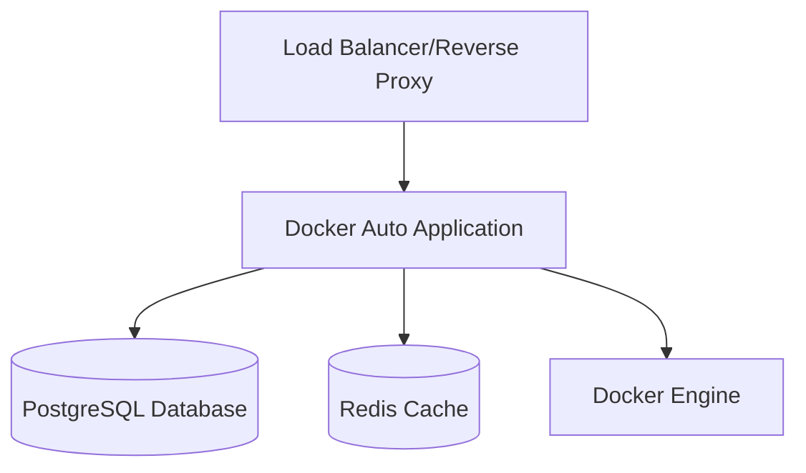
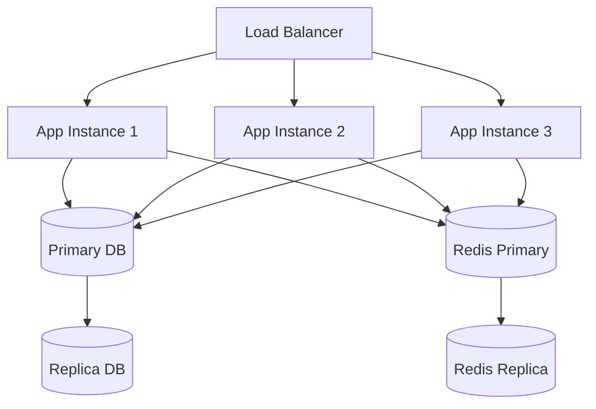

# Production Deployment Guide

## Overview

This guide provides comprehensive instructions for deploying the Docker Container Lifecycle Management System in production environments. The system supports both single-node and distributed deployments with high availability options.

## System Requirements

### Minimum Requirements (Single Node)

- **CPU**: 2 cores (4 cores recommended)
- **Memory**: 4GB RAM (8GB recommended)
- **Storage**: 50GB SSD (100GB recommended)
- **Network**: 1Gbps connection
- **OS**: Linux (Ubuntu 20.04+ LTS, CentOS 8+, RHEL 8+)

### Recommended Production Requirements

- **CPU**: 4+ cores per node
- **Memory**: 8GB+ RAM per node
- **Storage**: 100GB+ SSD with RAID
- **Network**: 10Gbps connection with redundancy
- **OS**: Latest LTS Linux distribution

### Dependencies

- **Docker**: 20.10+ with Docker Compose v2
- **PostgreSQL**: 13+ (external or containerized)
- **Redis**: 6+ (for caching and session management)
- **Load Balancer**: Nginx, HAProxy, or cloud load balancer
- **SSL Certificates**: Valid certificates for HTTPS

## Deployment Architecture

### Single Node Deployment



### High Availability Deployment



## Pre-deployment Checklist

### Infrastructure Preparation

- [ ] Provision servers with required specifications
- [ ] Configure network security groups/firewalls
- [ ] Set up monitoring and logging infrastructure
- [ ] Prepare backup storage solutions
- [ ] Configure DNS records
- [ ] Obtain SSL certificates

### Security Setup

- [ ] Configure system firewall rules
- [ ] Set up SSH key authentication
- [ ] Disable root login
- [ ] Configure fail2ban
- [ ] Set up log rotation
- [ ] Configure system monitoring

## Installation Methods

### Method 1: Docker Compose (Recommended for Single Node)

#### 1. Prepare the Environment

```bash
# Update system
sudo apt update && sudo apt upgrade -y

# Install Docker
curl -fsSL https://get.docker.com -o get-docker.sh
sudo sh get-docker.sh
sudo usermod -aG docker $USER

# Install Docker Compose
sudo apt install docker-compose-plugin -y

# Create application directory
sudo mkdir -p /opt/docker-auto
sudo chown $USER:$USER /opt/docker-auto
cd /opt/docker-auto
```

#### 2. Download Application

```bash
# Clone repository
git clone https://github.com/your-org/docker-auto.git .

# Or download specific release
wget https://github.com/your-org/docker-auto/archive/v2.3.0.tar.gz
tar -xzf v2.3.0.tar.gz --strip-components=1
```

#### 3. Configure Environment

```bash
# Copy environment template
cp .env.example .env.production

# Edit configuration
nano .env.production
```

**Production Environment Configuration**:
```bash
# Application Configuration
APP_ENV=production
APP_PORT=8080
APP_HOST=0.0.0.0

# Database Configuration
DB_TYPE=postgresql
DB_HOST=postgres
DB_PORT=5432
DB_NAME=dockerauto
DB_USER=dockerauto
DB_PASSWORD=your_secure_database_password_here

# Redis Configuration
REDIS_HOST=redis
REDIS_PORT=6379
REDIS_PASSWORD=your_secure_redis_password_here

# Security Configuration
JWT_SECRET=your_super_secure_jwt_secret_key_minimum_32_chars
JWT_EXPIRE_HOURS=24

# Docker Configuration
DOCKER_HOST=unix:///var/run/docker.sock
DOCKER_API_VERSION=1.41

# Monitoring Configuration
PROMETHEUS_ENABLED=true
METRICS_PORT=9090

# Logging Configuration
LOG_LEVEL=info
LOG_FORMAT=json

# Email Configuration (optional)
SMTP_HOST=smtp.gmail.com
SMTP_PORT=587
SMTP_USER=your-email@example.com
SMTP_PASSWORD=your-email-password

# Webhook Configuration (optional)
SLACK_WEBHOOK_URL=https://hooks.slack.com/services/YOUR/SLACK/WEBHOOK
```

#### 4. Production Docker Compose

Create `docker-compose.production.yml`:

```yaml
version: '3.8'

services:
  app:
    image: await2719/docker-auto:latest
    container_name: docker-auto-app
    restart: unless-stopped
    env_file: .env.production
    ports:
      - "8080:8080"
      - "9090:9090"  # Metrics port
    volumes:
      - /var/run/docker.sock:/var/run/docker.sock:ro
      - docker-auto-data:/app/data
      - docker-auto-logs:/app/logs
      - docker-auto-backups:/app/backups
    depends_on:
      - postgres
      - redis
    networks:
      - docker-auto-network
    healthcheck:
      test: ["CMD", "curl", "-f", "http://localhost:8080/health"]
      interval: 30s
      timeout: 10s
      retries: 3

  postgres:
    image: postgres:15-alpine
    container_name: docker-auto-postgres
    restart: unless-stopped
    environment:
      POSTGRES_DB: dockerauto
      POSTGRES_USER: dockerauto
      POSTGRES_PASSWORD: your_secure_database_password_here
      POSTGRES_INITDB_ARGS: "--auth-host=scram-sha-256"
    ports:
      - "5432:5432"
    volumes:
      - postgres-data:/var/lib/postgresql/data
      - ./backups/postgres:/backups
    networks:
      - docker-auto-network
    command: >
      postgres
      -c shared_preload_libraries=pg_stat_statements
      -c pg_stat_statements.track=all
      -c max_connections=200
      -c shared_buffers=256MB
      -c effective_cache_size=1GB

  redis:
    image: redis:7-alpine
    container_name: docker-auto-redis
    restart: unless-stopped
    command: >
      redis-server
      --requirepass your_secure_redis_password_here
      --maxmemory 512mb
      --maxmemory-policy allkeys-lru
      --save 900 1
      --save 300 10
      --save 60 10000
    ports:
      - "6379:6379"
    volumes:
      - redis-data:/data
    networks:
      - docker-auto-network

  nginx:
    image: nginx:alpine
    container_name: docker-auto-nginx
    restart: unless-stopped
    ports:
      - "80:80"
      - "443:443"
    volumes:
      - ./nginx/nginx.conf:/etc/nginx/nginx.conf:ro
      - ./nginx/conf.d:/etc/nginx/conf.d:ro
      - ./ssl:/etc/nginx/ssl:ro
      - nginx-logs:/var/log/nginx
    depends_on:
      - app
    networks:
      - docker-auto-network

volumes:
  docker-auto-data:
    driver: local
  docker-auto-logs:
    driver: local
  docker-auto-backups:
    driver: local
  postgres-data:
    driver: local
  redis-data:
    driver: local
  nginx-logs:
    driver: local

networks:
  docker-auto-network:
    driver: bridge
```

#### 5. Configure Nginx Reverse Proxy

Create `nginx/nginx.conf`:

```nginx
worker_processes auto;
error_log /var/log/nginx/error.log warn;
pid /var/run/nginx.pid;

events {
    worker_connections 1024;
    use epoll;
    multi_accept on;
}

http {
    include /etc/nginx/mime.types;
    default_type application/octet-stream;

    # Logging
    log_format main '$remote_addr - $remote_user [$time_local] "$request" '
                    '$status $body_bytes_sent "$http_referer" '
                    '"$http_user_agent" "$http_x_forwarded_for"';

    access_log /var/log/nginx/access.log main;

    # Performance
    sendfile on;
    tcp_nopush on;
    tcp_nodelay on;
    keepalive_timeout 65;
    types_hash_max_size 2048;

    # Security headers
    add_header X-Frame-Options "SAMEORIGIN" always;
    add_header X-Content-Type-Options "nosniff" always;
    add_header X-XSS-Protection "1; mode=block" always;
    add_header Referrer-Policy "no-referrer-when-downgrade" always;
    add_header Content-Security-Policy "default-src 'self' http: https: data: blob: 'unsafe-inline'" always;

    # Rate limiting
    limit_req_zone $binary_remote_addr zone=api:10m rate=10r/s;
    limit_req_zone $binary_remote_addr zone=login:10m rate=1r/s;

    include /etc/nginx/conf.d/*.conf;
}
```

Create `nginx/conf.d/docker-auto.conf`:

```nginx
upstream docker-auto-app {
    server app:8080;
    keepalive 32;
}

# HTTP redirect to HTTPS
server {
    listen 80;
    server_name your-domain.com www.your-domain.com;
    return 301 https://$server_name$request_uri;
}

# HTTPS server
server {
    listen 443 ssl http2;
    server_name your-domain.com www.your-domain.com;

    # SSL Configuration
    ssl_certificate /etc/nginx/ssl/fullchain.pem;
    ssl_certificate_key /etc/nginx/ssl/privkey.pem;
    ssl_protocols TLSv1.2 TLSv1.3;
    ssl_ciphers ECDHE-RSA-AES128-GCM-SHA256:ECDHE-RSA-AES256-GCM-SHA384;
    ssl_prefer_server_ciphers off;
    ssl_session_cache shared:SSL:10m;
    ssl_session_timeout 1d;

    # HSTS
    add_header Strict-Transport-Security "max-age=31536000; includeSubDomains" always;

    # Client upload limit
    client_max_body_size 100M;

    # API rate limiting
    location /api/ {
        limit_req zone=api burst=20 nodelay;
        proxy_pass http://docker-auto-app;
        proxy_http_version 1.1;
        proxy_set_header Upgrade $http_upgrade;
        proxy_set_header Connection 'upgrade';
        proxy_set_header Host $host;
        proxy_set_header X-Real-IP $remote_addr;
        proxy_set_header X-Forwarded-For $proxy_add_x_forwarded_for;
        proxy_set_header X-Forwarded-Proto $scheme;
        proxy_cache_bypass $http_upgrade;
        proxy_read_timeout 86400;
    }

    # WebSocket support
    location /ws/ {
        proxy_pass http://docker-auto-app;
        proxy_http_version 1.1;
        proxy_set_header Upgrade $http_upgrade;
        proxy_set_header Connection "upgrade";
        proxy_set_header Host $host;
        proxy_set_header X-Real-IP $remote_addr;
        proxy_set_header X-Forwarded-For $proxy_add_x_forwarded_for;
        proxy_set_header X-Forwarded-Proto $scheme;
        proxy_read_timeout 86400;
        proxy_send_timeout 86400;
    }

    # Login rate limiting
    location /api/auth/login {
        limit_req zone=login burst=5 nodelay;
        proxy_pass http://docker-auto-app;
        proxy_http_version 1.1;
        proxy_set_header Host $host;
        proxy_set_header X-Real-IP $remote_addr;
        proxy_set_header X-Forwarded-For $proxy_add_x_forwarded_for;
        proxy_set_header X-Forwarded-Proto $scheme;
    }

    # Static files and frontend
    location / {
        proxy_pass http://docker-auto-app;
        proxy_http_version 1.1;
        proxy_set_header Host $host;
        proxy_set_header X-Real-IP $remote_addr;
        proxy_set_header X-Forwarded-For $proxy_add_x_forwarded_for;
        proxy_set_header X-Forwarded-Proto $scheme;
        proxy_cache_bypass $http_upgrade;

        # Static file caching
        location ~* \.(js|css|png|jpg|jpeg|gif|ico|svg)$ {
            expires 1y;
            add_header Cache-Control "public, immutable";
        }
    }

    # Health check
    location /health {
        proxy_pass http://docker-auto-app/health;
        access_log off;
    }

    # Metrics (restrict access)
    location /metrics {
        allow 127.0.0.1;
        allow 10.0.0.0/8;
        deny all;
        proxy_pass http://docker-auto-app:9090/metrics;
    }
}
```

#### 6. Deploy Application

```bash
# Start services
docker-compose -f docker-compose.production.yml up -d

# Verify deployment
docker-compose -f docker-compose.production.yml ps
docker-compose -f docker-compose.production.yml logs -f

# Check health
curl http://localhost/health
```

### Method 2: Kubernetes Deployment

#### 1. Prepare Kubernetes Manifests

Create `k8s/namespace.yaml`:
```yaml
apiVersion: v1
kind: Namespace
metadata:
  name: docker-auto
```

Create `k8s/configmap.yaml`:
```yaml
apiVersion: v1
kind: ConfigMap
metadata:
  name: docker-auto-config
  namespace: docker-auto
data:
  APP_ENV: "production"
  DB_TYPE: "postgresql"
  DB_HOST: "postgres-service"
  DB_PORT: "5432"
  DB_NAME: "dockerauto"
  REDIS_HOST: "redis-service"
  REDIS_PORT: "6379"
  LOG_LEVEL: "info"
  PROMETHEUS_ENABLED: "true"
```

Create `k8s/secrets.yaml`:
```yaml
apiVersion: v1
kind: Secret
metadata:
  name: docker-auto-secrets
  namespace: docker-auto
type: Opaque
data:
  # Base64 encoded values
  DB_PASSWORD: <base64-encoded-db-password>
  JWT_SECRET: <base64-encoded-jwt-secret>
  REDIS_PASSWORD: <base64-encoded-redis-password>
```

#### 2. Deploy Application

```bash
# Apply manifests
kubectl apply -f k8s/

# Monitor deployment
kubectl get pods -n docker-auto
kubectl logs -f deployment/docker-auto-app -n docker-auto
```

## Post-Deployment Configuration

### 1. Initial Setup

```bash
# Access the application
curl http://your-domain.com/health

# Login with default credentials
# Email: admin@example.com
# Password: admin123
```

### 2. Security Hardening

**Change Default Password**:
1. Login to web interface
2. Navigate to Settings > Profile
3. Change password to strong password
4. Enable two-factor authentication if available

**Configure System Settings**:
1. Navigate to Settings > System
2. Configure session timeout
3. Set up audit logging
4. Configure backup schedules

### 3. Database Optimization

```sql
-- Connect to PostgreSQL
\c dockerauto

-- Create indexes for performance
CREATE INDEX CONCURRENTLY IF NOT EXISTS idx_containers_status ON containers(status);
CREATE INDEX CONCURRENTLY IF NOT EXISTS idx_containers_created_by ON containers(created_by);
CREATE INDEX CONCURRENTLY IF NOT EXISTS idx_update_histories_container_id ON update_histories(container_id);

-- Configure autovacuum
ALTER SYSTEM SET autovacuum_naptime = '1min';
ALTER SYSTEM SET autovacuum_vacuum_scale_factor = 0.1;
ALTER SYSTEM SET autovacuum_analyze_scale_factor = 0.05;
SELECT pg_reload_conf();
```

## Monitoring and Maintenance

### Application Monitoring

**Health Checks**:
- Application: `http://your-domain.com/health`
- Database connectivity
- Redis connectivity
- Docker daemon connectivity

**Metrics Collection**:
- Prometheus metrics at `/metrics`
- Application performance metrics
- Container operation statistics
- User activity metrics

### System Monitoring

**Resource Monitoring**:
```bash
# System resources
htop
iotop
df -h

# Docker resources
docker stats
docker system df

# Application logs
docker-compose logs -f app
tail -f /var/log/nginx/access.log
```

### Backup Procedures

**Database Backup**:
```bash
#!/bin/bash
# backup-database.sh

BACKUP_DIR="/opt/docker-auto/backups/postgres"
TIMESTAMP=$(date +%Y%m%d_%H%M%S)
BACKUP_FILE="dockerauto_backup_${TIMESTAMP}.sql"

# Create backup
docker exec docker-auto-postgres pg_dump -U dockerauto -d dockerauto > "${BACKUP_DIR}/${BACKUP_FILE}"

# Compress backup
gzip "${BACKUP_DIR}/${BACKUP_FILE}"

# Keep only last 30 days of backups
find "${BACKUP_DIR}" -name "*.gz" -mtime +30 -delete

echo "Backup completed: ${BACKUP_FILE}.gz"
```

**Application Data Backup**:
```bash
#!/bin/bash
# backup-application.sh

BACKUP_DIR="/opt/docker-auto/backups/application"
TIMESTAMP=$(date +%Y%m%d_%H%M%S)

# Create backup directory
mkdir -p "${BACKUP_DIR}/${TIMESTAMP}"

# Backup configuration
cp .env.production "${BACKUP_DIR}/${TIMESTAMP}/"
cp -r nginx/ "${BACKUP_DIR}/${TIMESTAMP}/"

# Backup application data
docker run --rm -v docker-auto-data:/data -v "${BACKUP_DIR}/${TIMESTAMP}":/backup alpine:latest tar czf /backup/app-data.tar.gz -C /data .

# Compress entire backup
tar czf "${BACKUP_DIR}/full_backup_${TIMESTAMP}.tar.gz" -C "${BACKUP_DIR}" "${TIMESTAMP}"
rm -rf "${BACKUP_DIR}/${TIMESTAMP}"

echo "Application backup completed: full_backup_${TIMESTAMP}.tar.gz"
```

### Log Management

**Log Rotation Configuration**:
```bash
# /etc/logrotate.d/docker-auto
/opt/docker-auto/logs/*.log {
    daily
    rotate 30
    compress
    delaycompress
    missingok
    create 644 root root
    postrotate
        docker-compose -f /opt/docker-auto/docker-compose.production.yml restart app
    endscript
}
```

## Scaling and High Availability

### Horizontal Scaling

**Load Balancer Configuration**:
- Use external load balancer (AWS ALB, GCP Load Balancer)
- Configure health checks
- Enable session stickiness if needed
- Set up SSL termination

**Database Scaling**:
- Set up PostgreSQL read replicas
- Configure connection pooling
- Implement database sharding if needed

**Redis Scaling**:
- Set up Redis Cluster or Sentinel
- Configure high availability
- Implement Redis persistence

### Disaster Recovery

**Backup Strategy**:
- Daily automated database backups
- Application configuration backups
- Container image backups
- Off-site backup storage

**Recovery Procedures**:
1. Restore database from backup
2. Redeploy application
3. Restore configuration
4. Verify system functionality

## Troubleshooting

### Common Issues

**Application Won't Start**:
```bash
# Check logs
docker-compose logs app

# Check health
curl http://localhost:8080/health

# Check dependencies
docker-compose ps
```

**Database Connection Issues**:
```bash
# Test database connection
docker exec -it docker-auto-postgres psql -U dockerauto -d dockerauto

# Check database logs
docker-compose logs postgres
```

**High Memory Usage**:
```bash
# Check container resource usage
docker stats

# Check application metrics
curl http://localhost:9090/metrics

# Optimize database
docker exec -it docker-auto-postgres psql -U dockerauto -d dockerauto -c "VACUUM ANALYZE;"
```

### Support and Maintenance

**Regular Maintenance Tasks**:
- Weekly security updates
- Monthly backup verification
- Quarterly performance review
- Annual disaster recovery testing

**Support Contacts**:
- System Administrator: admin@your-domain.com
- Technical Support: support@your-domain.com
- Emergency Contact: +1-555-0123

## Security Considerations

### Network Security

- Use HTTPS for all connections
- Implement proper firewall rules
- Use VPN for administrative access
- Regular security audits

### Application Security

- Regular dependency updates
- Security scanning of container images
- Proper authentication and authorization
- Audit logging and monitoring

### Data Security

- Encrypt data at rest
- Secure backup storage
- Regular access reviews
- Compliance with data protection regulations

## Conclusion

This deployment guide provides a comprehensive foundation for running the Docker Container Lifecycle Management System in production. Regular monitoring, maintenance, and security updates are essential for optimal operation.

For additional support or questions, consult the API documentation, user guides, or contact the support team.