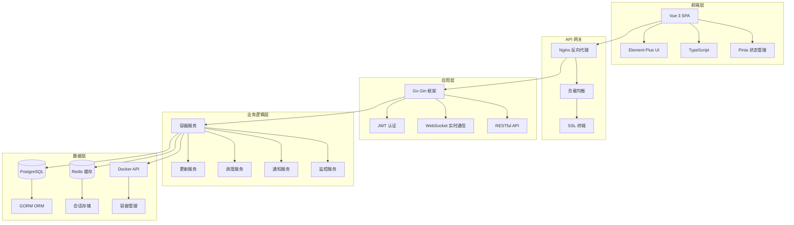

# 系统架构

## 整体架构

Docker Auto 采用现代化的微服务架构，前后端分离设计，具有良好的可扩展性和维护性。



## 技术栈

### 后端技术
- **语言**: Go 1.21+
- **框架**: Gin Web Framework
- **数据库**: PostgreSQL 13+
- **缓存**: Redis 6+
- **ORM**: GORM v2
- **认证**: JWT (JSON Web Tokens)
- **容器**: Docker API

### 前端技术
- **框架**: Vue 3 (Composition API)
- **语言**: TypeScript 4+
- **UI库**: Element Plus
- **状态管理**: Pinia
- **构建工具**: Vite
- **HTTP客户端**: Axios

### 基础设施
- **容器化**: Docker + Docker Compose
- **反向代理**: Nginx
- **监控**: Prometheus + Grafana (可选)
- **日志**: 结构化日志 (JSON)

## 核心模块

### 1. 认证与授权模块
```go
type AuthService struct {
    jwtManager *security.JWTManager
    userRepo   repository.UserRepository
    cache      *redis.Client
}
```

**功能**:
- JWT Token 生成和验证
- 用户会话管理
- 权限验证
- API 访问控制

### 2. 容器管理模块
```go
type ContainerService struct {
    dockerClient *docker.Client
    repository   repository.ContainerRepository
    scheduler    *SchedulerService
}
```

**功能**:
- 容器生命周期管理
- 镜像更新检测
- 配置管理
- 状态同步

### 3. 更新调度模块
```go
type UpdateService struct {
    scheduler    *cron.Cron
    strategies   map[string]UpdateStrategy
    notifier     *NotificationService
}
```

**功能**:
- 更新策略执行
- 计划任务调度
- 批量更新管理
- 回滚机制

### 4. 监控告警模块
```go
type MonitoringService struct {
    collector *MetricsCollector
    alerter   *AlertManager
    channels  []NotificationChannel
}
```

**功能**:
- 实时监控数据收集
- 告警规则评估
- 多渠道通知
- 历史数据存储

## 数据模型

### 用户模型
```go
type User struct {
    ID        uint      `gorm:"primaryKey"`
    Email     string    `gorm:"unique;not null"`
    Password  string    `gorm:"not null"`
    Role      Role      `gorm:"default:user"`
    CreatedAt time.Time
    UpdatedAt time.Time
}
```

### 容器模型
```go
type Container struct {
    ID            uint               `gorm:"primaryKey"`
    Name          string             `gorm:"unique;not null"`
    Image         string             `gorm:"not null"`
    Tag           string             `gorm:"default:latest"`
    Status        ContainerStatus    `gorm:"default:stopped"`
    UpdatePolicy  UpdatePolicy       `gorm:"default:manual"`
    Configuration JSON               `gorm:"type:jsonb"`
    CreatedBy     uint
    CreatedAt     time.Time
    UpdatedAt     time.Time
}
```

### 更新历史模型
```go
type UpdateHistory struct {
    ID          uint           `gorm:"primaryKey"`
    ContainerID uint           `gorm:"not null"`
    OldImage    string         `gorm:"not null"`
    NewImage    string
    Status      UpdateStatus   `gorm:"default:pending"`
    Strategy    UpdateStrategy `gorm:"default:rolling"`
    StartedAt   time.Time
    CompletedAt *time.Time
    Error       string
}
```

## API 设计

### RESTful API 结构
```
/api/v1/
├── auth/
│   ├── login          POST
│   ├── logout         POST
│   └── refresh        POST
├── users/
│   ├── /              GET, POST
│   └── /{id}          GET, PUT, DELETE
├── containers/
│   ├── /              GET, POST
│   ├── /{id}          GET, PUT, DELETE
│   ├── /{id}/start    POST
│   ├── /{id}/stop     POST
│   └── /{id}/logs     GET
├── updates/
│   ├── /              GET, POST
│   ├── /{id}          GET
│   └── /history       GET
└── monitoring/
    ├── /metrics       GET
    └── /health        GET
```

### WebSocket 接口
```
/ws/
├── containers        # 容器状态实时更新
├── updates           # 更新进度实时推送
└── monitoring        # 监控数据实时流
```

## 安全架构

### 认证流程
1. 用户登录获取 JWT Token
2. Token 包含用户信息和权限
3. 每个 API 请求验证 Token
4. Token 过期自动刷新

### 权限控制
- **基于角色的访问控制 (RBAC)**
- **API 级别权限验证**
- **资源级别权限检查**

### 数据安全
- 敏感数据加密存储
- API 通信 HTTPS 加密
- 定期安全扫描

## 部署架构

### 单机部署
```yaml
version: '3.8'
services:
  app:
    image: docker-auto:latest
    ports:
      - "80:80"

  postgres:
    image: postgres:15-alpine
    environment:
      POSTGRES_DB: dockerauto

  redis:
    image: redis:7-alpine
```

### 集群部署
```yaml
version: '3.8'
services:
  app:
    image: docker-auto:latest
    deploy:
      replicas: 3

  postgres:
    image: postgres:15-alpine
    deploy:
      replicas: 1

  redis:
    image: redis:7-alpine
    deploy:
      replicas: 1
```

## 性能优化

### 数据库优化
- 索引优化
- 查询优化
- 连接池配置
- 读写分离

### 缓存策略
- Redis 缓存热点数据
- HTTP 缓存头设置
- 静态资源 CDN
- API 响应缓存

### 并发处理
- Go 协程池
- 数据库连接池
- 请求限流
- 异步任务队列

## 监控与日志

### 监控指标
- 系统资源使用率
- API 响应时间
- 错误率统计
- 业务指标追踪

### 日志记录
- 结构化日志格式
- 日志级别管理
- 日志聚合收集
- 错误追踪

---

**更多技术细节** 请参考 [开发环境设置](development-setup.md) 和 [贡献指南](contributing.md)。