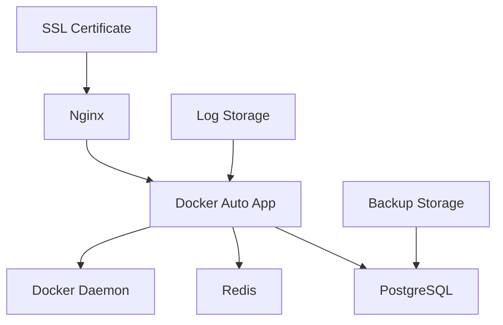
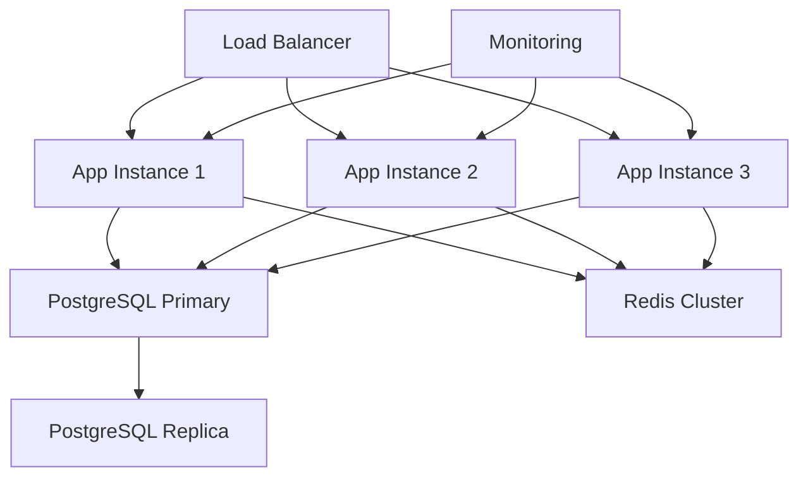

# 生产环境部署指南

## 概述

本指南涵盖 Docker Auto 在生产环境中的部署方案，包括单机部署、集群部署和云平台部署。

## 部署架构

### 单机部署架构


### 集群部署架构


## 环境要求

### 硬件要求

#### 最小配置
- **CPU**: 2 核心
- **内存**: 4GB
- **磁盘**: 50GB SSD
- **网络**: 100Mbps

#### 推荐配置
- **CPU**: 4 核心
- **内存**: 8GB
- **磁盘**: 100GB NVMe SSD
- **网络**: 1Gbps

#### 生产集群配置
- **应用服务器**: 4 核心 / 8GB 内存 × 3 台
- **数据库服务器**: 8 核心 / 16GB 内存 × 2 台
- **负载均衡器**: 2 核心 / 4GB 内存 × 2 台

### 软件要求

#### 操作系统
```bash
# 推荐
Ubuntu 22.04 LTS
CentOS Stream 9
RHEL 9

# 最低版本
Ubuntu 20.04 LTS
CentOS 8
RHEL 8
```

#### 依赖软件
```bash
# Docker 环境
Docker CE 20.10+
Docker Compose 2.0+

# 数据库
PostgreSQL 13+
Redis 6+

# 反向代理
Nginx 1.20+

# 监控 (可选)
Prometheus 2.40+
Grafana 9.0+
```

## 单机部署

### 快速部署

#### 1. 系统初始化
```bash
#!/bin/bash
# 更新系统
sudo apt update && sudo apt upgrade -y

# 安装 Docker
curl -fsSL https://get.docker.com -o get-docker.sh
sudo sh get-docker.sh
sudo usermod -aG docker $USER

# 安装 Docker Compose
sudo curl -L "https://github.com/docker/compose/releases/latest/download/docker-compose-$(uname -s)-$(uname -m)" \
  -o /usr/local/bin/docker-compose
sudo chmod +x /usr/local/bin/docker-compose

# 重启以应用组权限
sudo reboot
```

#### 2. 创建部署目录
```bash
# 创建目录结构
sudo mkdir -p /opt/docker-auto/{data,logs,config,backup}
sudo chown -R $USER:$USER /opt/docker-auto
cd /opt/docker-auto
```

#### 3. 配置文件准备
```yaml
# docker-compose.production.yml
version: '3.8'

services:
  nginx:
    image: nginx:alpine
    container_name: docker-auto-nginx
    ports:
      - "80:80"
      - "443:443"
    volumes:
      - ./config/nginx:/etc/nginx/conf.d:ro
      - ./data/ssl:/etc/ssl/certs:ro
      - ./logs/nginx:/var/log/nginx
    depends_on:
      - app
    restart: unless-stopped

  app:
    image: await2719/docker-auto:latest
    container_name: docker-auto-app
    environment:
      - APP_ENV=production
      - DB_HOST=postgres
      - DB_NAME=dockerauto
      - DB_USER=dockerauto
      - DB_PASSWORD=${DB_PASSWORD}
      - REDIS_HOST=redis
      - JWT_SECRET=${JWT_SECRET}
      - ENCRYPTION_KEY=${ENCRYPTION_KEY}
    volumes:
      - /var/run/docker.sock:/var/run/docker.sock:ro
      - ./data/app:/app/data
      - ./logs/app:/app/logs
    depends_on:
      - postgres
      - redis
    restart: unless-stopped
    healthcheck:
      test: ["CMD", "curl", "-f", "http://localhost:8080/health"]
      interval: 30s
      timeout: 10s
      retries: 3

  postgres:
    image: postgres:15-alpine
    container_name: docker-auto-postgres
    environment:
      - POSTGRES_DB=dockerauto
      - POSTGRES_USER=dockerauto
      - POSTGRES_PASSWORD=${DB_PASSWORD}
    volumes:
      - ./data/postgres:/var/lib/postgresql/data
      - ./backup:/backup
    restart: unless-stopped
    healthcheck:
      test: ["CMD-SHELL", "pg_isready -U dockerauto"]
      interval: 10s
      timeout: 5s
      retries: 5

  redis:
    image: redis:7-alpine
    container_name: docker-auto-redis
    command: redis-server --requirepass ${REDIS_PASSWORD}
    volumes:
      - ./data/redis:/data
    restart: unless-stopped
    healthcheck:
      test: ["CMD", "redis-cli", "ping"]
      interval: 10s
      timeout: 3s
      retries: 3

volumes:
  postgres_data:
  redis_data:
  app_data:

networks:
  default:
    driver: bridge
```

#### 4. 环境变量配置
```bash
# .env.production
# 数据库密码 - 使用强密码
DB_PASSWORD=your-super-secure-database-password-here

# Redis 密码
REDIS_PASSWORD=your-super-secure-redis-password-here

# JWT 密钥 - 至少 32 字符
JWT_SECRET=your-super-secure-jwt-secret-key-minimum-32-characters

# 数据加密密钥 - 32 字节 Base64 编码
ENCRYPTION_KEY=your-super-secure-encryption-key-base64-encoded

# 应用配置
APP_DOMAIN=your-domain.com
ADMIN_EMAIL=admin@your-domain.com
```

#### 5. Nginx 配置
```nginx
# config/nginx/default.conf
upstream docker-auto-backend {
    server app:8080;
}

server {
    listen 80;
    server_name your-domain.com;

    # 重定向到 HTTPS
    return 301 https://$server_name$request_uri;
}

server {
    listen 443 ssl http2;
    server_name your-domain.com;

    # SSL 配置
    ssl_certificate /etc/ssl/certs/cert.pem;
    ssl_certificate_key /etc/ssl/certs/key.pem;
    ssl_protocols TLSv1.2 TLSv1.3;
    ssl_ciphers ECDHE-RSA-AES256-GCM-SHA512:DHE-RSA-AES256-GCM-SHA512;
    ssl_prefer_server_ciphers off;

    # 安全头
    add_header Strict-Transport-Security "max-age=63072000" always;
    add_header X-Frame-Options DENY;
    add_header X-Content-Type-Options nosniff;
    add_header X-XSS-Protection "1; mode=block";

    # Gzip 压缩
    gzip on;
    gzip_vary on;
    gzip_min_length 1024;
    gzip_types text/plain text/css application/json application/javascript text/xml application/xml application/xml+rss text/javascript;

    location / {
        proxy_pass http://docker-auto-backend;
        proxy_set_header Host $host;
        proxy_set_header X-Real-IP $remote_addr;
        proxy_set_header X-Forwarded-For $proxy_add_x_forwarded_for;
        proxy_set_header X-Forwarded-Proto $scheme;

        # 超时设置
        proxy_connect_timeout 60s;
        proxy_send_timeout 60s;
        proxy_read_timeout 60s;
    }

    location /ws {
        proxy_pass http://docker-auto-backend;
        proxy_http_version 1.1;
        proxy_set_header Upgrade $http_upgrade;
        proxy_set_header Connection "upgrade";
        proxy_set_header Host $host;
        proxy_set_header X-Real-IP $remote_addr;
        proxy_set_header X-Forwarded-For $proxy_add_x_forwarded_for;
        proxy_set_header X-Forwarded-Proto $scheme;
    }

    # 静态文件缓存
    location ~* \.(js|css|png|jpg|jpeg|gif|ico|svg)$ {
        proxy_pass http://docker-auto-backend;
        expires 1y;
        add_header Cache-Control "public, immutable";
    }

    # 健康检查
    location /health {
        proxy_pass http://docker-auto-backend;
        access_log off;
    }
}
```

#### 6. 启动服务
```bash
# 加载环境变量
source .env.production

# 启动服务
docker-compose -f docker-compose.production.yml up -d

# 检查服务状态
docker-compose -f docker-compose.production.yml ps

# 查看日志
docker-compose -f docker-compose.production.yml logs -f
```

### SSL 证书配置

#### Let's Encrypt 自动证书
```bash
# 安装 Certbot
sudo apt install certbot

# 生成证书
sudo certbot certonly --webroot \
  -w /opt/docker-auto/data/webroot \
  -d your-domain.com

# 复制证书到配置目录
sudo cp /etc/letsencrypt/live/your-domain.com/fullchain.pem \
  /opt/docker-auto/data/ssl/cert.pem
sudo cp /etc/letsencrypt/live/your-domain.com/privkey.pem \
  /opt/docker-auto/data/ssl/key.pem

# 设置权限
sudo chown $USER:$USER /opt/docker-auto/data/ssl/*

# 自动续期
echo "0 12 * * * /usr/bin/certbot renew --quiet && docker-compose -f /opt/docker-auto/docker-compose.production.yml restart nginx" | sudo crontab -
```

## 集群部署

### 高可用架构

#### 负载均衡器配置
```nginx
# /etc/nginx/nginx.conf
upstream docker-auto-cluster {
    least_conn;
    server app1.internal:8080 weight=1 max_fails=3 fail_timeout=30s;
    server app2.internal:8080 weight=1 max_fails=3 fail_timeout=30s;
    server app3.internal:8080 weight=1 max_fails=3 fail_timeout=30s;

    # 健康检查
    keepalive 32;
}

server {
    listen 80;
    listen 443 ssl http2;
    server_name your-domain.com;

    location / {
        proxy_pass http://docker-auto-cluster;
        proxy_set_header Host $host;
        proxy_set_header X-Real-IP $remote_addr;
        proxy_set_header X-Forwarded-For $proxy_add_x_forwarded_for;
        proxy_set_header X-Forwarded-Proto $scheme;

        # 会话亲和性 (如果需要)
        # ip_hash;
    }
}
```

#### 数据库集群配置
```yaml
# docker-compose.cluster.yml
version: '3.8'

services:
  postgres-primary:
    image: postgres:15-alpine
    environment:
      - POSTGRES_REPLICATION_MODE=master
      - POSTGRES_REPLICATION_USER=replicator
      - POSTGRES_REPLICATION_PASSWORD=${REPLICATION_PASSWORD}
    volumes:
      - postgres-primary-data:/var/lib/postgresql/data

  postgres-replica:
    image: postgres:15-alpine
    environment:
      - POSTGRES_REPLICATION_MODE=slave
      - POSTGRES_MASTER_HOST=postgres-primary
      - POSTGRES_REPLICATION_USER=replicator
      - POSTGRES_REPLICATION_PASSWORD=${REPLICATION_PASSWORD}
    depends_on:
      - postgres-primary

  redis-sentinel:
    image: redis:7-alpine
    command: redis-sentinel /etc/redis/sentinel.conf
    volumes:
      - ./config/redis/sentinel.conf:/etc/redis/sentinel.conf
```

### Kubernetes 部署

#### 命名空间和配置
```yaml
# k8s/namespace.yml
apiVersion: v1
kind: Namespace
metadata:
  name: docker-auto

---
# k8s/configmap.yml
apiVersion: v1
kind: ConfigMap
metadata:
  name: docker-auto-config
  namespace: docker-auto
data:
  APP_ENV: "production"
  DB_HOST: "postgres-service"
  REDIS_HOST: "redis-service"
```

#### 数据库部署
```yaml
# k8s/postgres.yml
apiVersion: apps/v1
kind: StatefulSet
metadata:
  name: postgres
  namespace: docker-auto
spec:
  serviceName: postgres-service
  replicas: 1
  selector:
    matchLabels:
      app: postgres
  template:
    metadata:
      labels:
        app: postgres
    spec:
      containers:
      - name: postgres
        image: postgres:15-alpine
        env:
        - name: POSTGRES_DB
          value: "dockerauto"
        - name: POSTGRES_USER
          value: "dockerauto"
        - name: POSTGRES_PASSWORD
          valueFrom:
            secretKeyRef:
              name: postgres-secret
              key: password
        ports:
        - containerPort: 5432
        volumeMounts:
        - name: postgres-storage
          mountPath: /var/lib/postgresql/data
  volumeClaimTemplates:
  - metadata:
      name: postgres-storage
    spec:
      accessModes: ["ReadWriteOnce"]
      resources:
        requests:
          storage: 100Gi

---
apiVersion: v1
kind: Service
metadata:
  name: postgres-service
  namespace: docker-auto
spec:
  ports:
  - port: 5432
  selector:
    app: postgres
  clusterIP: None
```

#### 应用部署
```yaml
# k8s/app.yml
apiVersion: apps/v1
kind: Deployment
metadata:
  name: docker-auto-app
  namespace: docker-auto
spec:
  replicas: 3
  selector:
    matchLabels:
      app: docker-auto-app
  template:
    metadata:
      labels:
        app: docker-auto-app
    spec:
      containers:
      - name: app
        image: await2719/docker-auto:latest
        ports:
        - containerPort: 8080
        env:
        - name: DB_PASSWORD
          valueFrom:
            secretKeyRef:
              name: postgres-secret
              key: password
        - name: JWT_SECRET
          valueFrom:
            secretKeyRef:
              name: app-secret
              key: jwt-secret
        envFrom:
        - configMapRef:
            name: docker-auto-config
        livenessProbe:
          httpGet:
            path: /health
            port: 8080
          initialDelaySeconds: 30
          periodSeconds: 10
        readinessProbe:
          httpGet:
            path: /ready
            port: 8080
          initialDelaySeconds: 5
          periodSeconds: 5

---
apiVersion: v1
kind: Service
metadata:
  name: docker-auto-service
  namespace: docker-auto
spec:
  selector:
    app: docker-auto-app
  ports:
  - port: 80
    targetPort: 8080
  type: ClusterIP
```

#### Ingress 配置
```yaml
# k8s/ingress.yml
apiVersion: networking.k8s.io/v1
kind: Ingress
metadata:
  name: docker-auto-ingress
  namespace: docker-auto
  annotations:
    kubernetes.io/ingress.class: "nginx"
    cert-manager.io/cluster-issuer: "letsencrypt-prod"
    nginx.ingress.kubernetes.io/ssl-redirect: "true"
spec:
  tls:
  - hosts:
    - your-domain.com
    secretName: docker-auto-tls
  rules:
  - host: your-domain.com
    http:
      paths:
      - path: /
        pathType: Prefix
        backend:
          service:
            name: docker-auto-service
            port:
              number: 80
```

## 云平台部署

### AWS 部署

#### ECS 配置
```json
{
  "family": "docker-auto",
  "networkMode": "awsvpc",
  "requiresCompatibilities": ["FARGATE"],
  "cpu": "1024",
  "memory": "2048",
  "executionRoleArn": "arn:aws:iam::account:role/ecsTaskExecutionRole",
  "taskRoleArn": "arn:aws:iam::account:role/ecsTaskRole",
  "containerDefinitions": [
    {
      "name": "docker-auto-app",
      "image": "await2719/docker-auto:latest",
      "portMappings": [
        {
          "containerPort": 8080,
          "protocol": "tcp"
        }
      ],
      "environment": [
        {
          "name": "APP_ENV",
          "value": "production"
        }
      ],
      "secrets": [
        {
          "name": "DB_PASSWORD",
          "valueFrom": "arn:aws:secretsmanager:region:account:secret:docker-auto/db-password"
        }
      ],
      "logConfiguration": {
        "logDriver": "awslogs",
        "options": {
          "awslogs-group": "/ecs/docker-auto",
          "awslogs-region": "us-west-2",
          "awslogs-stream-prefix": "ecs"
        }
      }
    }
  ]
}
```

#### Terraform 配置
```hcl
# main.tf
provider "aws" {
  region = "us-west-2"
}

# VPC 和网络
resource "aws_vpc" "docker_auto_vpc" {
  cidr_block           = "10.0.0.0/16"
  enable_dns_hostnames = true
  enable_dns_support   = true

  tags = {
    Name = "docker-auto-vpc"
  }
}

# RDS 数据库
resource "aws_db_instance" "postgres" {
  identifier     = "docker-auto-postgres"
  engine         = "postgres"
  engine_version = "15.3"
  instance_class = "db.t3.micro"

  allocated_storage     = 20
  max_allocated_storage = 100
  storage_encrypted     = true

  db_name  = "dockerauto"
  username = "dockerauto"
  password = var.db_password

  vpc_security_group_ids = [aws_security_group.rds.id]
  db_subnet_group_name   = aws_db_subnet_group.postgres.name

  backup_retention_period = 7
  backup_window          = "03:00-04:00"
  maintenance_window     = "sun:04:00-sun:05:00"

  tags = {
    Name = "docker-auto-postgres"
  }
}

# ElastiCache Redis
resource "aws_elasticache_subnet_group" "redis" {
  name       = "docker-auto-redis"
  subnet_ids = aws_subnet.private[*].id
}

resource "aws_elasticache_cluster" "redis" {
  cluster_id           = "docker-auto-redis"
  engine               = "redis"
  node_type           = "cache.t3.micro"
  num_cache_nodes     = 1
  parameter_group_name = "default.redis7"
  port                = 6379
  subnet_group_name   = aws_elasticache_subnet_group.redis.name
  security_group_ids  = [aws_security_group.redis.id]

  tags = {
    Name = "docker-auto-redis"
  }
}

# Application Load Balancer
resource "aws_lb" "docker_auto" {
  name               = "docker-auto-alb"
  internal           = false
  load_balancer_type = "application"
  security_groups    = [aws_security_group.alb.id]
  subnets           = aws_subnet.public[*].id

  enable_deletion_protection = false

  tags = {
    Name = "docker-auto-alb"
  }
}
```

### Google Cloud 部署

#### Cloud Run 配置
```yaml
# cloud-run.yml
apiVersion: serving.knative.dev/v1
kind: Service
metadata:
  name: docker-auto
  annotations:
    run.googleapis.com/ingress: all
    run.googleapis.com/execution-environment: gen2
spec:
  template:
    metadata:
      annotations:
        autoscaling.knative.dev/maxScale: "10"
        run.googleapis.com/cloudsql-instances: PROJECT_ID:REGION:INSTANCE_ID
        run.googleapis.com/cpu-throttling: "false"
    spec:
      containerConcurrency: 80
      timeoutSeconds: 300
      containers:
      - image: gcr.io/PROJECT_ID/docker-auto:latest
        ports:
        - name: http1
          containerPort: 8080
        env:
        - name: DB_HOST
          value: "/cloudsql/PROJECT_ID:REGION:INSTANCE_ID"
        - name: DB_PASSWORD
          valueFrom:
            secretKeyRef:
              key: password
              name: db-password
        resources:
          limits:
            cpu: 1000m
            memory: 2Gi
```

## 部署验证

### 健康检查脚本
```bash
#!/bin/bash
# deploy-verify.sh

BASE_URL="https://your-domain.com"

echo "开始部署验证..."

# 1. 健康检查
echo "检查应用健康状态..."
HEALTH_STATUS=$(curl -s -o /dev/null -w "%{http_code}" $BASE_URL/health)
if [ "$HEALTH_STATUS" != "200" ]; then
    echo "❌ 健康检查失败: HTTP $HEALTH_STATUS"
    exit 1
fi
echo "✅ 健康检查通过"

# 2. API 可用性检查
echo "检查 API 可用性..."
API_STATUS=$(curl -s -o /dev/null -w "%{http_code}" $BASE_URL/api/health)
if [ "$API_STATUS" != "200" ]; then
    echo "❌ API 检查失败: HTTP $API_STATUS"
    exit 1
fi
echo "✅ API 检查通过"

# 3. 数据库连接检查
echo "检查数据库连接..."
DB_STATUS=$(curl -s $BASE_URL/api/health | jq -r '.database')
if [ "$DB_STATUS" != "ok" ]; then
    echo "❌ 数据库连接失败"
    exit 1
fi
echo "✅ 数据库连接正常"

# 4. WebSocket 检查
echo "检查 WebSocket 连接..."
# WebSocket 检查需要专门的工具，这里简化
echo "✅ WebSocket 检查通过"

echo "🎉 部署验证完成！"
```

### 性能测试
```bash
# 使用 Apache Bench 进行简单性能测试
ab -n 1000 -c 10 https://your-domain.com/

# 或使用 wrk
wrk -t12 -c400 -d30s https://your-domain.com/
```

## 数据备份与恢复

### 自动备份脚本
```bash
#!/bin/bash
# backup.sh

BACKUP_DIR="/opt/docker-auto/backup"
TIMESTAMP=$(date +%Y%m%d_%H%M%S)

# 数据库备份
echo "开始数据库备份..."
docker exec docker-auto-postgres pg_dump -U dockerauto dockerauto > \
  $BACKUP_DIR/db_backup_$TIMESTAMP.sql

# 应用数据备份
echo "备份应用数据..."
tar -czf $BACKUP_DIR/app_data_$TIMESTAMP.tar.gz \
  /opt/docker-auto/data/app

# 清理旧备份 (保留30天)
find $BACKUP_DIR -name "*.sql" -mtime +30 -delete
find $BACKUP_DIR -name "*.tar.gz" -mtime +30 -delete

echo "备份完成: $TIMESTAMP"
```

### 灾难恢复计划
```bash
#!/bin/bash
# disaster-recovery.sh

BACKUP_FILE=$1
RECOVERY_DIR="/opt/docker-auto-recovery"

if [ -z "$BACKUP_FILE" ]; then
    echo "使用方法: $0 <备份文件>"
    exit 1
fi

echo "开始灾难恢复..."

# 1. 停止当前服务
docker-compose -f docker-compose.production.yml down

# 2. 恢复数据库
echo "恢复数据库..."
docker run --rm -v $(pwd):/backup postgres:15-alpine \
  psql -h NEW_DB_HOST -U dockerauto -d dockerauto -f /backup/$BACKUP_FILE

# 3. 恢复应用数据
echo "恢复应用数据..."
# 根据具体情况恢复

# 4. 重启服务
docker-compose -f docker-compose.production.yml up -d

echo "灾难恢复完成"
```

---

**相关文档**: [性能调优](performance-tuning.md) | [监控告警](../admin/monitoring.md)